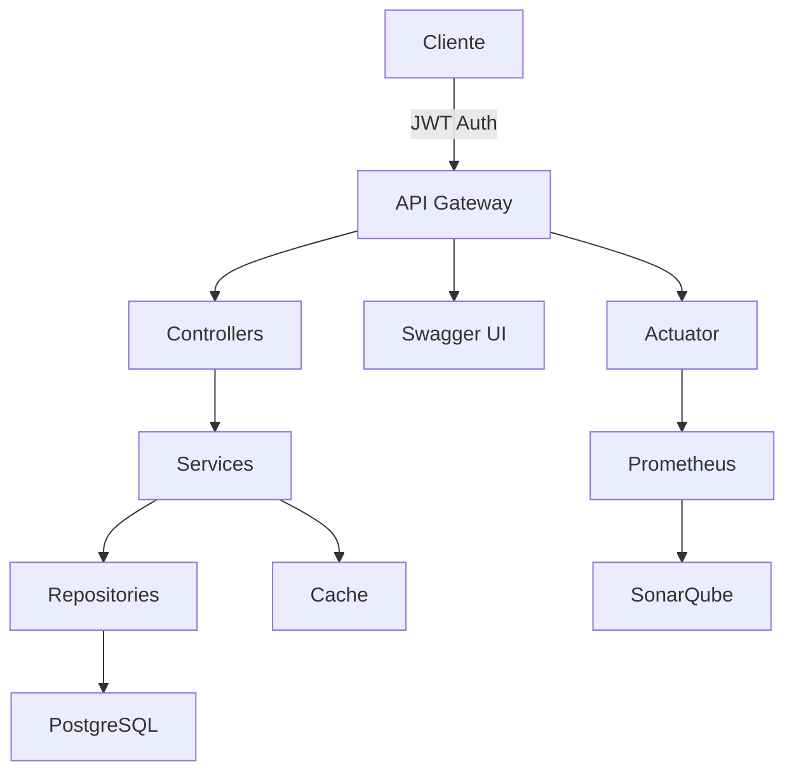

# Dream Shops - E-commerce API

Uma API REST completa para e-commerce desenvolvida com Spring Boot 3, oferecendo funcionalidades robustas para gerenciamento de produtos, usuários, carrinhos e pedidos.

## 🚀 Funcionalidades

### 👤 Gestão de Usuários
- Autenticação JWT
- Roles: ADMIN e USER
- CRUD completo de usuários
- Perfil e preferências

### 🛍️ Produtos e Categorias
- Cadastro e gestão de produtos
- Categorização
- Upload de imagens
- Busca e filtros avançados

### 🛒 Carrinho de Compras
- Adicionar/remover itens
- Atualizar quantidades
- Cálculo automático de totais
- Persistência de carrinho

### 📦 Pedidos
- Criação de pedidos
- Histórico de compras
- Status de pedido
- Detalhamento completo

## 🛠️ Tecnologias Utilizadas

### Backend
- **Java 21**: Última versão LTS
- **Spring Boot 3.1.5**: Framework web
- **Spring Security**: Autenticação e autorização
- **JWT**: Tokens de autenticação
- **JPA/Hibernate**: Persistência
- **PostgreSQL 16**: Banco de dados
- **Lombok**: Redução de boilerplate
- **ModelMapper**: Mapeamento de objetos

### Documentação
- **SpringDoc OpenAPI**: Documentação automática
- **Swagger UI**: Interface interativa da API

### Monitoramento
- **Spring Actuator**: Métricas e saúde
- **Prometheus**: Coleta de métricas
- **SonarQube**: Qualidade de código

### DevOps
- **Docker**: Containerização
- **Docker Compose**: Orquestração
- **Maven**: Gestão de dependências

## 📊 Arquitetura

## 🔒 Segurança

- Autenticação baseada em JWT
- Senhas criptografadas com BCrypt
- Proteção contra CSRF
- Validação de entrada
- Roles e permissões
- Headers de segurança

## 📝 Endpoints Principais

### Autenticação
- `POST /api/v1/auth/login`: Login de usuário
- `POST /api/v1/users/add`: Registro de novo usuário

### Produtos
- `GET /api/v1/products/all`: Lista todos os produtos
- `GET /api/v1/products/{id}`: Detalhes do produto
- `POST /api/v1/products/add`: Adiciona produto (ADMIN)
- `PUT /api/v1/products/{id}`: Atualiza produto (ADMIN)

### Carrinho
- `GET /api/v1/carts/{id}`: Visualiza carrinho
- `POST /api/v1/cartItems/add`: Adiciona item
- `DELETE /api/v1/carts/{id}`: Limpa carrinho

### Pedidos
- `POST /api/v1/orders/create`: Cria pedido
- `GET /api/v1/orders/{id}`: Detalhes do pedido
- `GET /api/v1/orders/user/{id}`: Pedidos do usuário

## 🌟 Recursos Avançados

- **Paginação**: Resultados paginados para melhor performance
- **Caching**: Cache de produtos e categorias
- **Validação**: Validação robusta de entrada
- **Logs**: Logging estruturado
- **Métricas**: Monitoramento detalhado
- **Documentação**: API totalmente documentada

## 📈 Escalabilidade

- Arquitetura em camadas
- Desacoplamento de componentes
- Cache distribuído
- Containerização
- Monitoramento em tempo real

## 🤝 Contribuição

1. Fork o projeto
2. Crie sua Feature Branch (`git checkout -b feature/AmazingFeature`)
3. Commit suas mudanças (`git commit -m 'Add some AmazingFeature'`)
4. Push para a Branch (`git push origin feature/AmazingFeature`)
5. Abra um Pull Request

## 📄 Licença

Este projeto está sob a licença MIT. Veja o arquivo [LICENSE](LICENSE) para mais detalhes. 